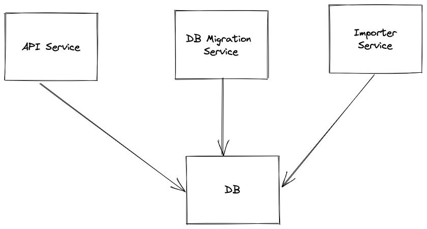

# FindHotel

<h1> Architecture </h1>

The project uses the docker compose file to manager various services. Each of the above services are basically 
a docker container running in sync with each other on same network securely. 

- API Service
   - This service serves the HTTP server on port 9090 and exposes it. It fetches data from the DB container and servers to client.
  
- DB Migration Service
  - This service is the migration container which is responsible to run any database migration available like creating tables, indexes, constraints etc.

- Importer Service
  - This service parses the data from the dump csv file, validates it, cleans it and stores it into the database.

  

<h1>Installation</h1>

<h2>Prerequisite:</h2>

1) The docker is installed locally.
2) The latest version of Go. You can get it from https://golang.org/doc/install
3) The `make` tool is installed.

<h2> Import Service </h2>
Before calling the API you need to import the data in your database. Please follow below instruction to import the data. Make sure you have already started API by now using above steps.

<h4> Steps to import the data </h4>

1) Prepare a csv file named `data_dump.csv` in following format and put it in the `cmd/import` directory of project.

   <h3>CSV Format:</h3>

            ip_address,country_code,country,city,latitude,longitude,mystery_value
            200.106.141.15,SI,Nepal,DuBuquemouth,-84.87503094689836,7.206435933364332,7823011346

2) Run the command in terminal: `make import`

Note: 
- Please wait until the import is complete. Depending on your csv file size, it might take time.
- You can see the statistics of import operation inside the `importer` docker container. 

<h2> API Service </h2>

<h4> Steps to start the API </h4>

1) Start the docker locally, If not started already
2) Run the command in terminal: `make run-app`

Now you can call the API at `GET http://localhost:3000/v1/ip-info?ip=<ip_address>`

------------------------------------------------------------------------------------------------------------------------

